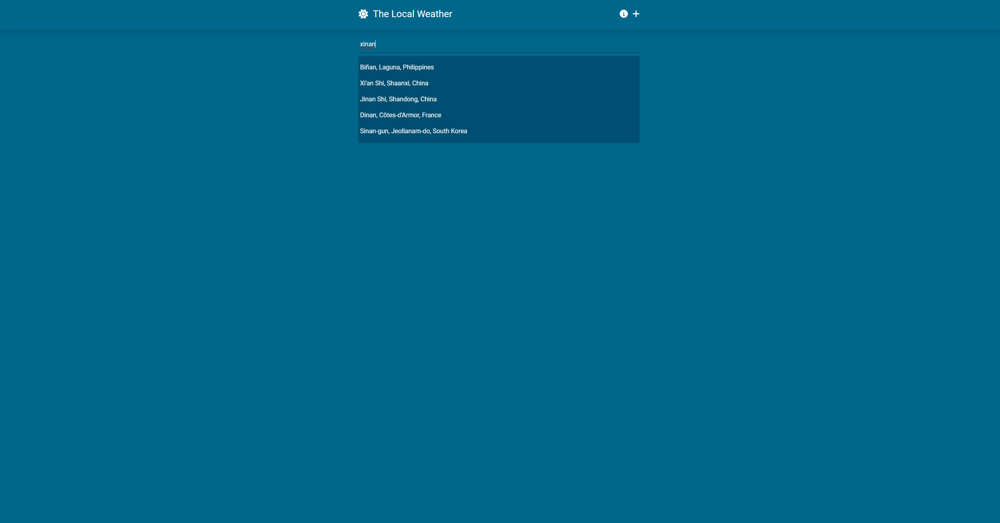
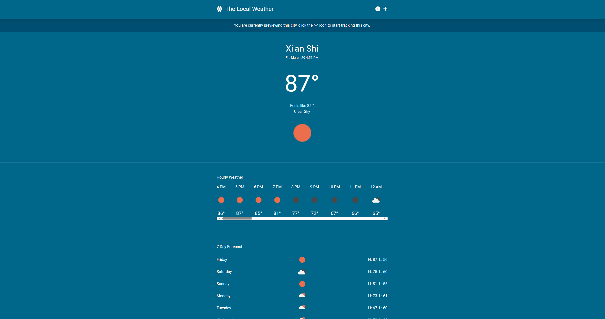
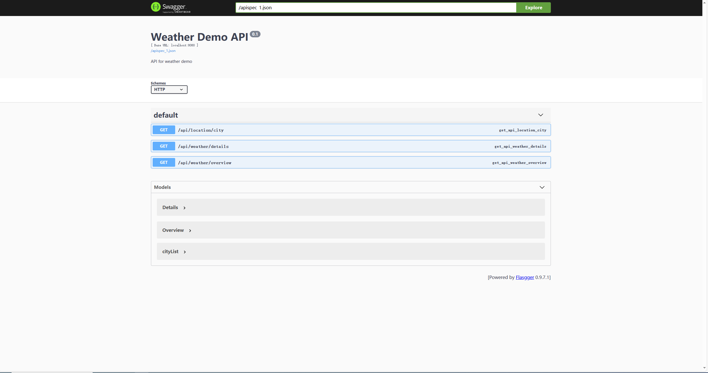

# Weather Application Demo

## Recommended environment
Linux operating system installed docker and docker-compose

## Build Backend Image
```shell
docker build -t weather_backend:0.1-3.9.18 ./
```

## Project Run
```
docker-compose up -d
```

## Access Project
browser access address https://localhost




## Access Swagger Doc
browser access address http://localhost:8080
